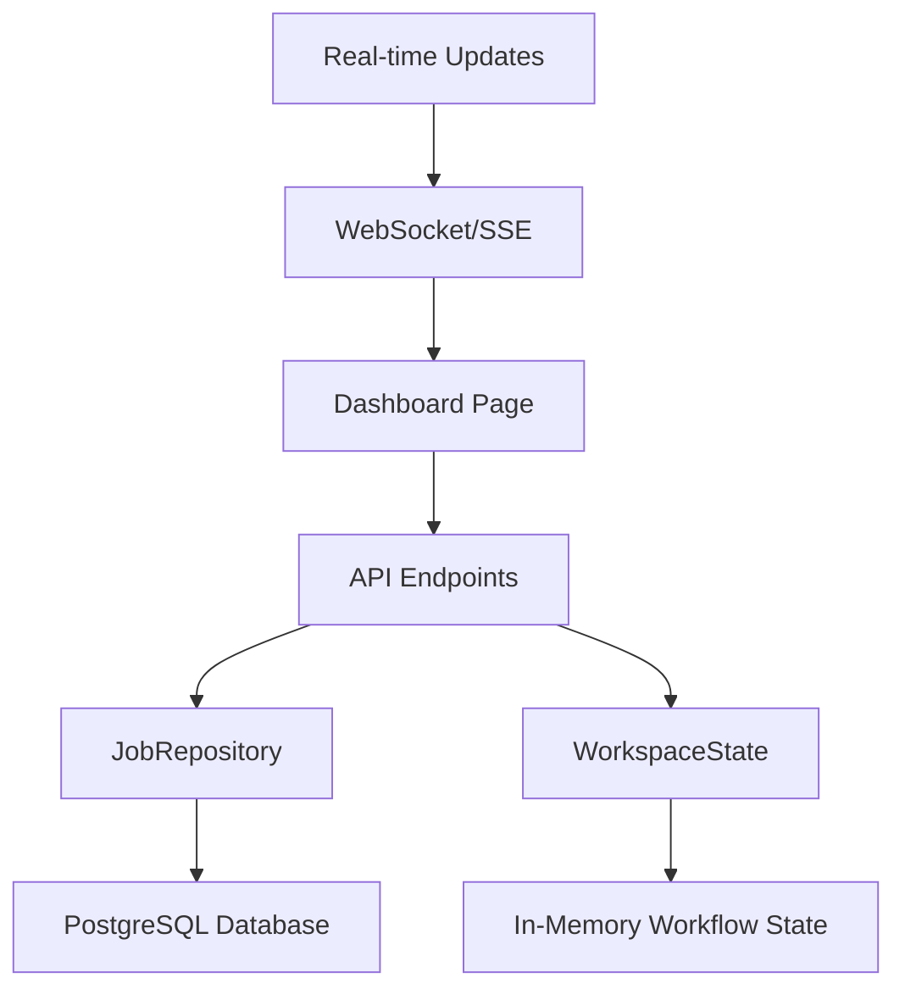

# Design Document

## Overview

This design document outlines the implementation of a comprehensive dashboard for the Strøm orchestration platform. The dashboard will provide real-time and historical insights into job execution, system performance, and workflow health through a series of interactive widgets and metrics displays.

## Architecture

### Frontend Architecture

The dashboard will be implemented as a SvelteKit page (`ui/src/routes/+page.svelte`) with a modular widget-based architecture:

```
Dashboard Page
├── SystemStatusWidget
├── JobExecutionMetricsWidget  
├── RecentActivityWidget
└── JobExecutionTrendsWidget
```

### Backend Architecture

New API endpoints will be added to `server/src/web/api.rs` to support dashboard metrics:

```
/api/dashboard/system-status    - System health and worker status
/api/dashboard/job-metrics      - Job execution statistics
/api/dashboard/recent-activity  - Recent jobs and alerts
/api/dashboard/job-trends       - Historical job execution data
```

### Data Flow



## Components and Interfaces

### 1. Dashboard Page Component

**File**: `ui/src/routes/+page.svelte`

**Props**: None (root page component)

**State Management**:
- Fetches dashboard data on mount
- Refreshes data every 30 seconds
- Handles loading and error states for all widgets

### 2. SystemStatusWidget Component

**File**: `ui/src/lib/components/molecules/SystemStatusWidget.svelte`

**Props**:
```typescript
interface SystemStatusProps {
  systemStatus?: SystemStatus;
  loading?: boolean;
  error?: string | null;
}
```

**Features**:
- Displays active workers count
- Shows total jobs executed today
- Shows system uptime
- Displays system alerts with severity indicators

### 3. JobExecutionMetricsWidget Component

**File**: `ui/src/lib/components/molecules/JobExecutionMetricsWidget.svelte`

**Props**:
```typescript
interface JobExecutionMetricsProps {
  metrics?: JobExecutionMetrics;
  loading?: boolean;
  error?: string | null;
}
```

**Features**:
- Shows today's job statistics (total, success rate, failure rate)
- Displays average job execution time
- Shows job status distribution (running, completed, failed, queued)
- Highlights workflows with highest failure rates

### 4. RecentActivityWidget Component

**File**: `ui/src/lib/components/molecules/RecentActivityWidget.svelte`

**Props**:
```typescript
interface RecentActivityProps {
  recentJobs?: RecentJob[];
  alerts?: SystemAlert[];
  upcomingJobs?: UpcomingJob[];
  loading?: boolean;
  error?: string | null;
}
```

**Features**:
- Real-time feed of last 10 job executions
- Recent failures with error summaries
- System alerts (worker disconnections, auth failures)
- Currently running jobs with progress
- Next 5 scheduled executions

### 5. JobExecutionTrendsWidget Component

**File**: `ui/src/lib/components/molecules/JobExecutionTrendsWidget.svelte`

**Props**:
```typescript
interface JobExecutionTrendsProps {
  trendsData?: JobTrendsData;
  loading?: boolean;
  error?: string | null;
}
```

**Features**:
- Time-series chart of job executions over last 7 days
- Success/failure rate trends
- Interactive chart with hover tooltips
- Time range selector (1 hour, 24 hours, 7 days)

## Data Models

### SystemStatus Interface

```typescript
interface SystemStatus {
  active_workers: number;
  idle_workers: number;
  total_jobs_today: number;
  system_uptime: string; // ISO duration format
  average_execution_time_24h: number; // seconds
  alerts: SystemAlert[];
}

interface SystemAlert {
  id: string;
  severity: 'info' | 'warning' | 'error';
  message: string;
  timestamp: string;
  source?: string;
}
```

### JobExecutionMetrics Interface

```typescript
interface JobExecutionMetrics {
  today: {
    total_jobs: number;
    success_count: number;
    failure_count: number;
    success_rate: number; // percentage
  };
  status_distribution: {
    running: number;
    completed: number;
    failed: number;
    queued: number;
  };
  top_failing_workflows: Array<{
    workflow_name: string;
    failure_rate: number;
    total_executions: number;
  }>;
  average_execution_time: number; // seconds
}
```

### RecentActivity Interface

```typescript
interface RecentJob {
  job_id: string;
  task_name: string;
  status: ExecutionStatus;
  start_time: string;
  duration?: number;
  triggered_by: string;
}

interface UpcomingJob {
  task_name: string;
  scheduled_time: string;
  trigger_type: string;
  estimated_duration?: number;
}
```

### JobTrendsData Interface

```typescript
interface JobTrendsData {
  time_series: Array<{
    timestamp: string;
    total_jobs: number;
    successful_jobs: number;
    failed_jobs: number;
  }>;
  time_range: '1h' | '24h' | '7d';
}
```

## API Endpoints Design

### GET /api/dashboard/system-status

**Response**:
```json
{
  "data": {
    "active_workers": 3,
    "idle_workers": 1,
    "total_jobs_today": 142,
    "system_uptime": "P2DT14H30M",
    "average_execution_time_24h": 45.2,
    "alerts": [
      {
        "id": "alert-001",
        "severity": "warning",
        "message": "Worker node-02 has been idle for 2 hours",
        "timestamp": "2024-01-15T10:30:00Z",
        "source": "worker-monitor"
      }
    ]
  }
}
```

### GET /api/dashboard/job-metrics

**Response**:
```json
{
  "data": {
    "today": {
      "total_jobs": 142,
      "success_count": 135,
      "failure_count": 7,
      "success_rate": 95.07
    },
    "status_distribution": {
      "running": 3,
      "completed": 135,
      "failed": 7,
      "queued": 2
    },
    "top_failing_workflows": [
      {
        "workflow_name": "data-sync",
        "failure_rate": 15.2,
        "total_executions": 23
      }
    ],
    "average_execution_time": 42.8
  }
}
```

### GET /api/dashboard/recent-activity

**Response**:
```json
{
  "data": {
    "recent_jobs": [
      {
        "job_id": "job-123",
        "task_name": "backup-database",
        "status": "completed",
        "start_time": "2024-01-15T10:25:00Z",
        "duration": 120.5,
        "triggered_by": "scheduler:daily"
      }
    ],
    "upcoming_jobs": [
      {
        "task_name": "cleanup-logs",
        "scheduled_time": "2024-01-15T12:00:00Z",
        "trigger_type": "cron",
        "estimated_duration": 30
      }
    ]
  }
}
```

### GET /api/dashboard/job-trends

**Query Parameters**:
- `range`: '1h' | '24h' | '7d' (default: '24h')

**Response**:
```json
{
  "data": {
    "time_series": [
      {
        "timestamp": "2024-01-15T09:00:00Z",
        "total_jobs": 12,
        "successful_jobs": 11,
        "failed_jobs": 1
      }
    ],
    "time_range": "24h"
  }
}
```

## Database Schema Extensions

### New Queries Required

The implementation will use existing tables but require new aggregation queries:

1. **System Status Queries**:
   - Count active workers (from application state)
   - Count jobs executed today
   - Calculate average execution time for last 24 hours

2. **Job Metrics Queries**:
   - Daily job statistics with success/failure breakdown
   - Current job status distribution
   - Top failing workflows by failure rate

3. **Recent Activity Queries**:
   - Last 10 job executions with details
   - Currently running jobs with progress
   - Next scheduled jobs (from workflow configuration)

4. **Trends Queries**:
   - Hourly/daily job execution aggregates
   - Time-series data for specified ranges

### Repository Extensions

**File**: `server/src/repository/job.rs`

New methods to add:
```rust
impl JobRepository {
    pub async fn get_system_metrics(&self) -> Result<SystemStatus, Error>;
    pub async fn get_job_execution_metrics(&self) -> Result<JobExecutionMetrics, Error>;
    pub async fn get_recent_activity(&self, limit: u32) -> Result<Vec<RecentJob>, Error>;
    pub async fn get_job_trends(&self, range: &str) -> Result<JobTrendsData, Error>;
    pub async fn get_upcoming_jobs(&self, limit: u32) -> Result<Vec<UpcomingJob>, Error>;
}
```

## Error Handling

### Frontend Error Handling

Each widget will implement consistent error handling:

1. **Loading States**: Show skeleton loaders while fetching data
2. **Error States**: Display user-friendly error messages with retry buttons
3. **Partial Failures**: Allow individual widgets to fail without breaking the entire dashboard
4. **Retry Logic**: Implement exponential backoff for failed requests

### Backend Error Handling

API endpoints will return consistent error responses:

```json
{
  "error": {
    "message": "Failed to retrieve system metrics",
    "code": "SYSTEM_METRICS_ERROR",
    "details": {
      "database_error": "Connection timeout"
    }
  },
  "success": false
}
```

## Testing Strategy

### Unit Tests

1. **Component Tests**: Test each dashboard widget in isolation
2. **API Tests**: Test new dashboard endpoints with mock data
3. **Repository Tests**: Test new database queries with test data

### Integration Tests

1. **Dashboard Page Tests**: Test full dashboard loading and interaction
2. **API Integration Tests**: Test complete request/response cycles
3. **Real-time Update Tests**: Test WebSocket/SSE functionality

### Performance Tests

1. **Query Performance**: Ensure dashboard queries execute within 500ms
2. **Concurrent Load**: Test dashboard performance with multiple users
3. **Data Volume**: Test with large datasets (10k+ jobs)

### Test Files Structure

```
ui/src/lib/components/molecules/
├── SystemStatusWidget.test.ts
├── JobExecutionMetricsWidget.test.ts
├── RecentActivityWidget.test.ts
└── JobExecutionTrendsWidget.test.ts

server/src/web/
└── dashboard_api.test.rs

server/src/repository/
└── dashboard_queries.test.rs
```

## Performance Considerations

### Caching Strategy

1. **System Status**: Cache for 30 seconds (frequently changing)
2. **Job Metrics**: Cache for 5 minutes (moderate frequency)
3. **Trends Data**: Cache for 15 minutes (historical data)

### Database Optimization

1. **Indexes**: Add indexes on frequently queried columns:
   - `job.start_datetime` for time-based queries
   - `job.status` for status filtering
   - `job.task_name` for workflow grouping

2. **Query Optimization**: Use efficient aggregation queries with proper LIMIT clauses

### Real-time Updates

1. **WebSocket Events**: Push updates for job status changes
2. **Selective Updates**: Only update changed metrics, not entire dashboard
3. **Throttling**: Limit update frequency to prevent UI thrashing

## Security Considerations

### Authentication

All dashboard endpoints will require authentication using the existing JWT system.

### Authorization

Dashboard access will be controlled by user roles:
- **Admin**: Full dashboard access
- **User**: Limited to job execution metrics
- **Viewer**: Read-only access to basic metrics

### Data Sanitization

All user-provided data (search terms, filters) will be sanitized to prevent injection attacks.

## Accessibility

### WCAG Compliance

1. **Color Contrast**: Ensure 4.5:1 contrast ratio for all text
2. **Keyboard Navigation**: Full keyboard accessibility for all interactive elements
3. **Screen Readers**: Proper ARIA labels and semantic HTML
4. **Focus Management**: Clear focus indicators and logical tab order

### Responsive Design

Dashboard will be fully responsive with breakpoints:
- **Mobile**: Single column layout, simplified widgets
- **Tablet**: Two-column layout, condensed information
- **Desktop**: Full multi-column layout with all features

## Deployment Considerations

### Feature Flags

Dashboard features will be controlled by configuration flags:
```yaml
dashboard:
  enabled: true
  refresh_interval: 30000  # milliseconds
  cache_ttl: 300          # seconds
```

### Monitoring

Dashboard performance will be monitored:
1. **API Response Times**: Track dashboard endpoint performance
2. **Error Rates**: Monitor dashboard-specific error rates
3. **User Engagement**: Track dashboard usage patterns

### Rollback Strategy

If issues arise:
1. **Feature Flag Disable**: Quickly disable dashboard via configuration
2. **Fallback UI**: Show simple "Dashboard unavailable" message
3. **Gradual Rollout**: Enable for subset of users initially