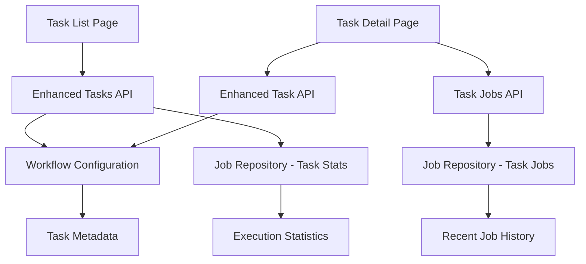
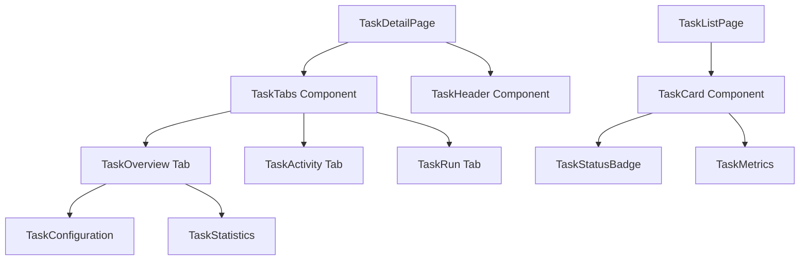

# Design Document

## Overview

This design enhances the task management interface in Strøm by providing richer information display in both the task list and individual task views. The solution focuses on aggregating job execution data with task configuration to present comprehensive task insights while maintaining the existing architecture and API patterns.

## Architecture

### Data Flow Architecture



### Component Architecture



## Components and Interfaces

### Backend API Enhancements

#### Enhanced Tasks API Endpoint
- **Endpoint**: `GET /api/tasks`
- **Enhancement**: Aggregate job statistics for each task with pagination support
- **Query Parameters**:
  - `page`: Page number (default: 1)
  - `limit`: Items per page (default: 25, max: 100)
  - `sort`: Sort field (name, lastExecution, successRate)
  - `order`: Sort order (asc, desc)
  - `search`: Search term for task names/descriptions
- **Response Structure**:
```typescript
interface PaginatedTasksResponse {
  data: EnhancedTask[];
  pagination: {
    page: number;
    limit: number;
    total: number;
    totalPages: number;
    hasNext: boolean;
    hasPrev: boolean;
  };
}

interface EnhancedTask {
  id: string;
  name?: string;
  description?: string;
  input?: Record<string, InputField>;
  flow: Record<string, FlowStep>;
  
  // New aggregated fields
  statistics: {
    totalExecutions: number;
    successRate: number;
    lastExecution?: {
      timestamp: string;
      status: 'success' | 'failed' | 'running';
      triggeredBy: string; // source_type:source_id
    };
    averageDuration?: number; // in seconds
  };
}
```

#### Task Jobs API Endpoint
- **Endpoint**: `GET /api/tasks/{task_id}/jobs`
- **Purpose**: Get recent job executions for a specific task with pagination
- **Query Parameters**:
  - `page`: Page number (default: 1)
  - `limit`: Items per page (default: 20, max: 100)
  - `status`: Filter by job status (success, failed, running, queued)
  - `sort`: Sort field (startDateTime, duration, status)
  - `order`: Sort order (asc, desc)
- **Response Structure**:
```typescript
interface PaginatedJobsResponse {
  data: TaskJobSummary[];
  pagination: {
    page: number;
    limit: number;
    total: number;
    totalPages: number;
    hasNext: boolean;
    hasPrev: boolean;
  };
}
```

### Frontend Component Enhancements

#### TaskCard Component
**Location**: `ui/src/lib/components/molecules/TaskCard.svelte`

**Props Interface**:
```typescript
interface TaskCardProps {
  task: EnhancedTask;
  onClick?: () => void;
}
```

**Features**:
- Display task name and description
- Show execution statistics (total runs, success rate)
- Display last execution status with timestamp
- Show who triggered the last execution
- Provide visual status indicators
- Support click navigation to task detail

#### TaskHeader Component
**Location**: `ui/src/lib/components/molecules/TaskHeader.svelte`

**Props Interface**:
```typescript
interface TaskHeaderProps {
  task: EnhancedTask;
  onRunTask?: () => void;
}
```

**Features**:
- Display task name and description prominently
- Show key statistics in header area
- Provide "Run Task" action button
- Include breadcrumb navigation

#### TaskStatistics Component
**Location**: `ui/src/lib/components/molecules/TaskStatistics.svelte`

**Props Interface**:
```typescript
interface TaskStatisticsProps {
  statistics: TaskStatistics;
}

interface TaskStatistics {
  totalExecutions: number;
  successRate: number;
  averageDuration?: number;
  lastExecution?: LastExecution;
}
```

**Features**:
- Display execution metrics in card format
- Show success rate with visual indicators
- Display average execution time
- Show last execution details

#### TaskConfiguration Component
**Location**: `ui/src/lib/components/molecules/TaskConfiguration.svelte`

**Props Interface**:
```typescript
interface TaskConfigurationProps {
  task: Task;
}
```

**Features**:
- Display input parameters with types and defaults
- Show flow steps with dependencies
- Provide expandable sections for complex configuration
- Include parameter documentation

#### Pagination Component
**Location**: `ui/src/lib/components/molecules/Pagination.svelte`

**Props Interface**:
```typescript
interface PaginationProps {
  currentPage: number;
  totalPages: number;
  totalItems: number;
  itemsPerPage: number;
  onPageChange: (page: number) => void;
  onPageSizeChange: (size: number) => void;
  pageSizeOptions?: number[];
}
```

**Features**:
- Display current page, total pages, and item counts
- Provide page navigation controls (first, previous, next, last)
- Include page size selector with configurable options
- Support keyboard navigation and accessibility
- Show loading states during page transitions

### Enhanced Page Components

#### Enhanced Task List Page
**Location**: `ui/src/routes/tasks/+page.svelte`

**Enhancements**:
- Replace simple cards with enhanced TaskCard components
- Add sorting controls (name, last execution, success rate)
- Implement responsive grid layout
- Add loading states and error handling
- Include search functionality

#### Enhanced Task Detail Page
**Location**: `ui/src/routes/tasks/[taskId]/+page.svelte`

**Enhancements**:
- Add TaskHeader component with statistics
- Enhance Overview tab with TaskConfiguration and TaskStatistics
- Improve Activity tab with better job history display
- Maintain existing Run tab functionality
- Add breadcrumb navigation

## Data Models

### Enhanced Task Statistics
```typescript
interface TaskStatistics {
  totalExecutions: number;
  successRate: number; // 0-100
  lastExecution?: {
    timestamp: string;
    status: 'success' | 'failed' | 'running' | 'queued';
    triggeredBy: string;
    duration?: number; // seconds
  };
  averageDuration?: number; // seconds
  recentTrend: 'improving' | 'declining' | 'stable';
}
```

### Job Summary for Task View
```typescript
interface TaskJobSummary {
  jobId: string;
  status: string;
  startDateTime: string;
  endDateTime?: string;
  duration?: number;
  triggeredBy: string;
  success?: boolean;
}
```

### Pagination Metadata
```typescript
interface PaginationInfo {
  page: number;
  limit: number;
  total: number;
  totalPages: number;
  hasNext: boolean;
  hasPrev: boolean;
}

interface PaginatedResponse<T> {
  data: T[];
  pagination: PaginationInfo;
}
```

### API Query Parameters
```typescript
interface TaskListQuery {
  page?: number;
  limit?: number;
  sort?: 'name' | 'lastExecution' | 'successRate';
  order?: 'asc' | 'desc';
  search?: string;
}

interface JobListQuery {
  page?: number;
  limit?: number;
  status?: 'success' | 'failed' | 'running' | 'queued';
  sort?: 'startDateTime' | 'duration' | 'status';
  order?: 'asc' | 'desc';
}
```

## Error Handling

### API Error Scenarios
1. **Task Statistics Unavailable**: Display task without statistics, show "No execution data" message
2. **Database Connection Issues**: Show cached data if available, display connection error
3. **Invalid Task ID**: Redirect to task list with error message
4. **Permission Denied**: Show appropriate access denied message

### Frontend Error Handling
1. **Loading States**: Show skeleton loaders for task cards and statistics
2. **Network Errors**: Display retry buttons and error messages
3. **Data Validation**: Handle missing or malformed task data gracefully
4. **Navigation Errors**: Provide fallback navigation options

## Testing Strategy

### Backend Testing
1. **Unit Tests**: Test task statistics aggregation logic
2. **Integration Tests**: Test enhanced API endpoints with database
3. **Performance Tests**: Verify query performance with large datasets
4. **API Contract Tests**: Ensure response format consistency

### Frontend Testing
1. **Component Tests**: Test TaskCard, TaskHeader, and TaskStatistics components
2. **Page Tests**: Test enhanced task list and detail pages
3. **Integration Tests**: Test data loading and error scenarios
4. **Accessibility Tests**: Verify keyboard navigation and screen reader support
5. **Visual Regression Tests**: Ensure consistent styling across components

### User Acceptance Testing
1. **Task Management Workflows**: Test complete user journeys
2. **Performance Validation**: Verify page load times and responsiveness
3. **Cross-browser Testing**: Ensure compatibility across browsers
4. **Mobile Responsiveness**: Test on various screen sizes

## Implementation Considerations

### Performance Optimization
- Implement database query optimization for task statistics
- Add caching layer for frequently accessed task data
- Use pagination for large task lists
- Implement lazy loading for task details

### Accessibility
- Ensure proper ARIA labels for status indicators
- Implement keyboard navigation for all interactive elements
- Provide screen reader friendly descriptions for statistics
- Maintain proper color contrast for status indicators

### Responsive Design
- Use CSS Grid for flexible task card layouts
- Implement mobile-first responsive design
- Ensure touch-friendly interface elements
- Optimize for various screen sizes and orientations

### Future Extensibility
- Design component interfaces to support additional metrics
- Plan for real-time updates via WebSocket integration
- Consider task favoriting and personal dashboards
- Prepare for advanced filtering and search capabilities